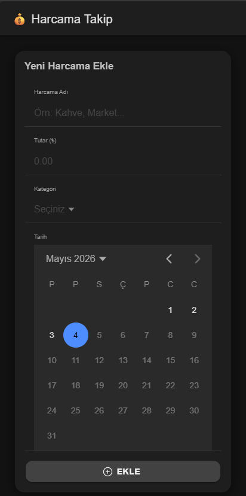
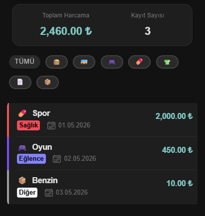
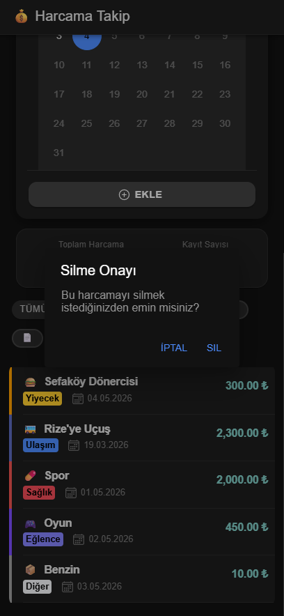
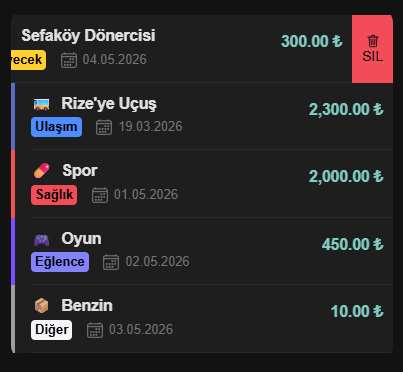
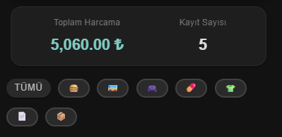
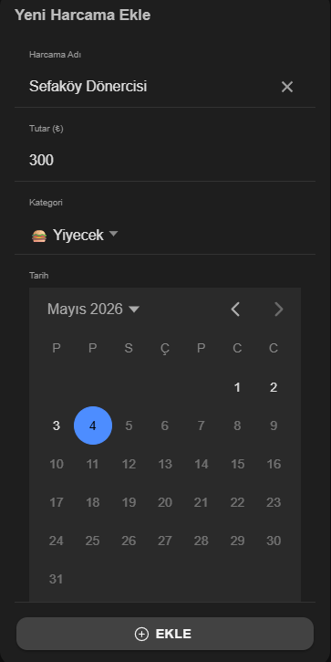

# HarcamaTakip-Ionic
İonic ile geliştirilen bir harcama takip uygulaması.

💰 Ionic Harcama Takip Uygulaması\

📑 Proje Senaryosu ve Amaç
Projenin temel amacı, mobil arayüz geliştirme, TypeScript ile veri yönetimi ve LocalStorage kullanarak veri kalıcılığı sağlama konularında yetkinlik kazanmaktır. Uygulama üzerinden harcama eklenebilir, listelenebilir, dinamik olarak toplam tutar görülebilir ve sliding (kaydırma) yöntemiyle kayıtlar silinebilir.

🚀 Öne Çıkan Özellikler & Bonuslar
Dinamik Veri Girişi: Harcama adı, tutar, kategori ve takvim üzerinden tarih seçimi yapılabilir.

Akıllı Özet Paneli: Toplam harcama miktarı ve kayıt sayısı anlık olarak hesaplanıp kullanıcıya sunulur.

Görsel Kategorizasyon: Her harcama türüne özel ikonlar ve renkli etiketler (Yiyecek, Ulaşım, Sağlık vb.) atanmıştır.

Kalıcı Hafıza: Veriler tarayıcının veya cihazın LocalStorage alanında saklanır, uygulama kapatılsa dahi kaybolmaz.

UX Odaklı Silme İşlemi: ion-item-sliding kullanılarak satırı kaydırınca çıkan silme butonu eklenmiştir.

Güvenli Silme: Veri kaybını önlemek adına silme işlemi öncesi kullanıcıdan onay (Alert) istenir.

Geri Bildirim: Yeni bir harcama eklendiğinde yeşil bir Toast mesajı ile kullanıcı bilgilendirilir.

🛠️ Teknik Bileşenler (UI Kit)
Ödevde istenen tüm Ionic bileşenleri projeye entegre edilmiştir:

Navigasyon: ion-header, ion-toolbar, ion-title.

Form Yapısı: ion-input, ion-select, ion-datetime, ion-button.

Veri Sunumu: ion-card, ion-list, ion-item, ion-item-sliding, ion-item-options.

📸 Uygulama Görüntüleri
Projenin arayüz akışını aşağıdaki görseller üzerinden inceleyebilirsiniz:
   

 

 

 

 

 

 

   
Harcama Girişi: Form yapısı ve takvim kullanımı.

Liste Ekranı: Dinamik toplam tutar ve kategorize edilmiş harcamalar.

İşlem Akışı: Silme onayı ve başarılı işlem bildirimleri.

⚙️ Kurulum ve Çalıştırma
Projeyi yerel ortamınızda ayağa kaldırmak için:

Bağımlılıkları yükleyin:

Bash
npm install
Geliştirme sunucusunu başlatın:

Bash
ionic serve

Geliştirici: Mehmet Akif Balcı
